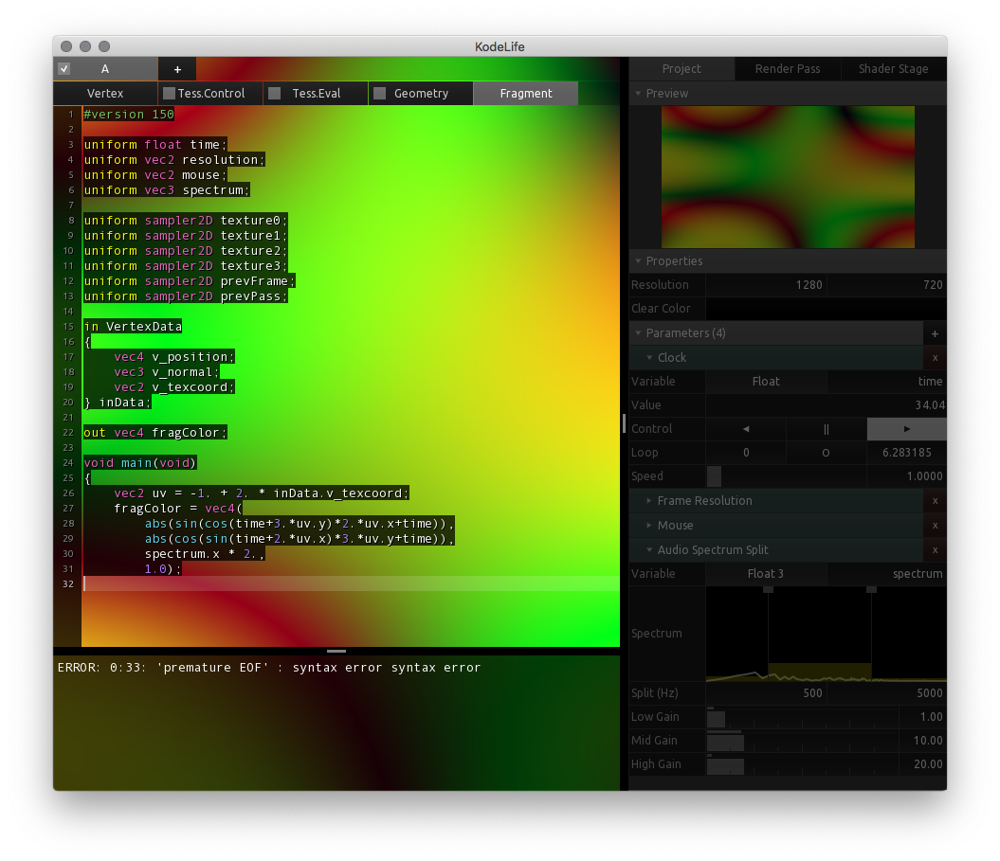
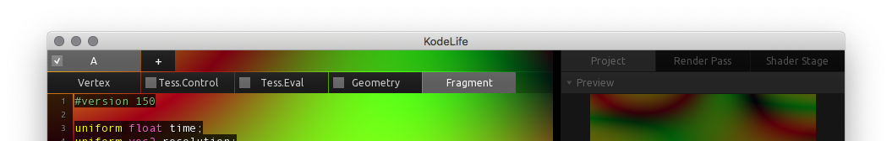
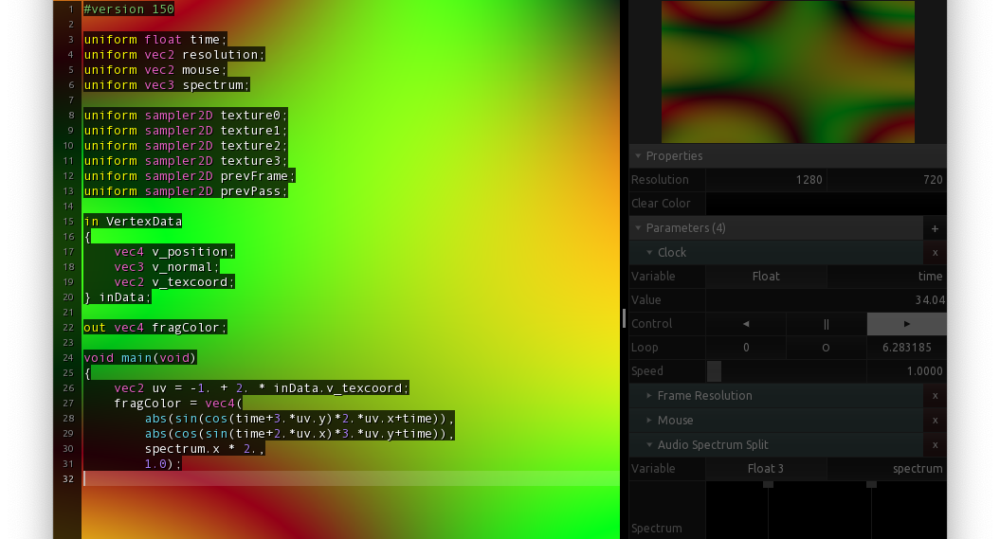
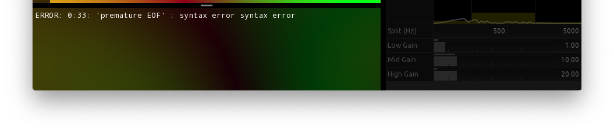

[Products](https://hexler.net/products) [Support](https://hexler.net/support) [Contact](https://hexler.net/contact)

Open main menu

[Products](https://hexler.net/products) [News](https://hexler.net/news) [Support](https://hexler.net/support) [Contact](https://hexler.net/contact)

[ **KodeLife**  
\
**Real-time GPU shader editor**](https://hexler.net/kodelife)

###### [Introduction](internal-display.md)

###### [Getting started](getting-started.md)

###### [Interface](interface.md)

- [Editor](interface-editor.md)
- [Output](interface-output.md)
- [Menu Bar](interface-menubar.md)

###### [Kontrol Panel](kontrolpanel.md)

- [Project](kontrolpanel-project.md)
- [Pass](kontrolpanel-pass.md)
- [Shader Stage](kontrolpanel-shaderstage.md)

###### [Parameters](parameters.md)

- [Built-In](parameters-built-in.md)
- [Constant](parameters-constant.md)

###### [Preferences](preferences-general.md)

- [General](preferences-general.md)
- [Editor](preferences-editor.md)
- [Output](preferences-output.md)
- [Shader](preferences-shader.md)
- [Audio](preferences-audio.md)

KodeLife Manual

#### Interface · Editor

* * *

The left part of the application window is occupied by the **code editor** and associated user interface. Most people working with tools for program construction in any capacity will be familiar with the structure visible here, but we'll briefly look at the components making up this area:

* * *

##### Tab Bar

At the very top is the tab bar, which allows to switch between **two levels** of a project's structure. The tab bar **can be completely hidden** from either the [Editor Preferences](preferences-editor.md) or from the menu bar's [View menu](interface-menubar.md).

###### Passes

The first level is the **pass** level, where you can

- **Switch** between the passes contained in the project
- **Add** new passes using the special **+** tab at the end
- **Enable/disable** existing passes using the checkbox on the left of each tab

For a discussion of KodeLife's pass concept and associated options, please see [Pass](kontrolpanel-pass.md) in the [Kontrol Panel](kontrolpanel.md) section.

###### Shader Stages

The second level allows to switch between the **source code** for the different shader stages of any given pass.

The **number of available stages** here might differ depending on the graphics API you have enabled in the [Preferences](preferences-general.md#graphics-api), the type of pass, and which shader stages are supported by your GPU's driver, version and configuration.

KodeLife will **automatically create a tab** for all shader stages supported by the current graphics API and driver and pass type, but it is **possible to hide unwanted shader stages**' tabs in the Kontrol Panel's [Shader Stages](kontrolpanel-shaderstage.md#shader-stages) list, to focus only on the ones required for your project.

###### Keyboard Shortcuts

It is also possible to switch between passes and shader stages using the following keyboard shortcuts:

- **CTRL/CMD + 1**-**9** will switch to shader stage tab 1-9
- **CTRL/CMD + SHIFT + 1**-**9** will switch to pass tab 1-9

* * *

##### Code Editor

The **main editing area** is where the **shader source code** can be modified and where most of the work/magic happens.

KodeLife's editor tries to assist as much as possible by **highlighting syntax**, **indicating error lines** and **completing** common shading language constructs as you type. The behavior and appearance of this area can be customized in many ways in the [Editor Preferences](preferences-editor.md) and menu bar's [View Menu](interface-menubar.md).

As it might come in handy in certain situations and applications, there even exists a [Built-in Parameter](parameters-built-in.md#frame-editor) that can generate a **rendered image** of the currently active editor's contents for use as a texture input to your shaders.

###### Keyboard Shortcuts

Besides the usual editing key combinations, such as copy/paste/select/find/etc, the code editor also provides some additional, useful keyboard shortcurts:

- **TAB** will increase the indentation of the current selection
- **SHIFT + TAB** will decrease the indentation of the current selection
- **CTRL/CMD + /** will comment or uncomment the current selection or line
- **CTRL/CMD + D** will duplicate the current selection or line

macOS only:

- **CMD + {** or **}** will decrease / increase indentation of the current selection or line

* * *

##### Output panel

The output panel is a text area where **messages returned by the graphics API's shader compiler** are displayed.

This could be **general messages, warnings or errors**. These messages are very specific to the operating system, version and type of the enabled graphics API, brand and vendor of your graphics card and the installed driver. Changing any of these will probably result in completely different messages, even for the exact same shader source code!

The output panel can also be completely hidden from either the [Editor Preferences](preferences-editor.md) or in the menu bar's [View Menu](interface-menubar.md).

* * *

## hexler

- [Products](https://hexler.net/products)
- [News](https://hexler.net/news)
- [About](https://hexler.net/about)

## Support

- [Manuals](https://hexler.net/support/manuals)
- [Search](https://hexler.net/search)
- [Contact](https://hexler.net/contact)

## Legal

- [Terms of Service](https://hexler.net/terms-of-service)
- [Privacy Policy](https://hexler.net/privacy-policy)
- [Cookie Policy](https://hexler.net/cookie-policy)
- [特定商取引法](https://hexler.net/commercial-law)

Copyright © 2025 Hexler Limited. All rights reserved. v1.9.2.482

Cookie Policy

We use cookies to deliver website content. By continuing without changing your [preferences](https://hexler.net/cookie-policy), you agree to our use of cookies.

Accept