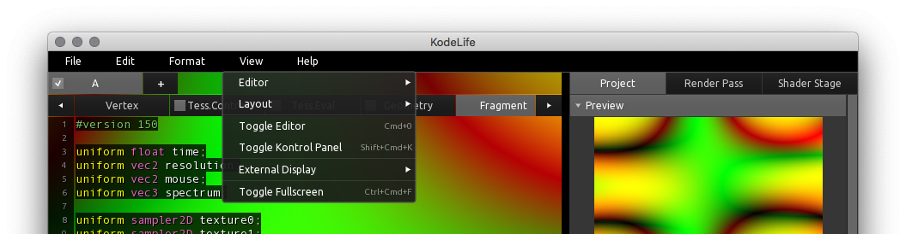

[Products](https://hexler.net/products) [Support](https://hexler.net/support) [Contact](https://hexler.net/contact)

Open main menu

[Products](https://hexler.net/products) [News](https://hexler.net/news) [Support](https://hexler.net/support) [Contact](https://hexler.net/contact)

[ **KodeLife**  
\
**Real-time GPU shader editor**](https://hexler.net/kodelife)

###### [Introduction](internal-display.md)

###### [Getting started](getting-started.md)

###### [Interface](interface.md)

- [Editor](interface-editor.md)
- [Output](interface-output.md)
- [Menu Bar](interface-menubar.md)

###### [Kontrol Panel](kontrolpanel.md)

- [Project](kontrolpanel-project.md)
- [Pass](kontrolpanel-pass.md)
- [Shader Stage](kontrolpanel-shaderstage.md)

###### [Parameters](parameters.md)

- [Built-In](parameters-built-in.md)
- [Constant](parameters-constant.md)

###### [Preferences](preferences-general.md)

- [General](preferences-general.md)
- [Editor](preferences-editor.md)
- [Output](preferences-output.md)
- [Shader](preferences-shader.md)
- [Audio](preferences-audio.md)

KodeLife Manual

#### Interface · Menu Bar

* * *

The menu bar is a pretty standard component of any application so most functions found here will be rather self-explanatory. Nonetheless, there is some functionality that **can only be found here** so it is worth highlighting some of these items.

**Note** that for macOS users the in-window menu bar will be hidden and the OS's standard menu bar look and feel will be used. Except for some items that try to adhere to the OS' common UI conventions, most functionality is named and grouped the same, and we consider the differences so minimal as to not discuss them in detail.

* * *

##### File

###### New From Template...

Create a new KodeLife project based on one of the **built-in templates**.

Currently KodeLife ships with a template to facilitate porting of shader code from the popular [Shadertoy](https://shadertoy.com) website, and a template for the basic structure of shaders following the popular [The Book of Shaders](https://thebookofshaders.com/) introduction to shader programming.

We will be adding more templates in future releases.

###### Load/Save Buffer...

In contrast to the standard **File &gt; Open/Save/Save As..** menu items (which save and load complete KodeLife project files), these items load and save only the **currently selected** (ie visible in the editor) shader stage's **source code to a plain text file**.

###### Export - Image

Export a PNG encoded image file of the current master output image. The image file will be written to disk in a pre-defined location depending on operating system:

- **macOS / Windows**
  
  The *KodeLife* folder inside the current user's *Documents* directory
- **Linux**
  
  The application's *current working directory* (usually the user's home directory or the location from where the application was launched on the command line)

* * *

##### Format

###### Font Bigger/Smaller

Globally increase or decrease the **font size of editor and output panel** views in discrete steps.

* * *

##### View

###### Toggle Editor

Toggle the visibility of the [code editor](interface-editor.md).

**Note** that this is only an option when the [Window Layout](preferences-general.md#window-layout) preference option is set to **Stack**.

###### Toggle Kontrol Panel

Toggle the visibility of the [Kontrol Panel](kontrolpanel.md).

###### Toggle Interface

Toggle the visibility of all interface elements except for the output preview.

###### Toggle Fullscreen

Toggle **all** of KodeLife's currently open windows to/from fullscreen state.

If you'd like to toggle **only one** of KodeLife's currently open windows to/from fullscreen state, focus the window by clicking into its area, and use the **keyboard shortcut** listed next to this menu item.

* * *

##### Help

###### KodeLife Help

This menu item will open your system's **default browser** at the URL of KodeLife's **online documentation** on the Hexler website.

**Note** that no additional information about the application or your system will be transmitted to the website when using this function.

###### Contact Us

This menu item will open your system's **default browser** at the URL of the Hexler website's [online contact form](https://hexler.net/contact), with some **useful information** about the **version of KodeLife** you are using and some key characteristics about your **operating system** and currently enabled **renderer** pre-filled for you.

This is so to make it **easier to include some relevant information** about your system for our **support staff**, in case you have a specific **problem or feature suggestion** you would like to submit to us.

The provided information will not be submitted automatically, and you will have the chance to **inspect and edit the information** that the application has pre-filled for you when the contact form is displayed to you after the browser has finished launching and opening the page.

If you have any concerns or questions about our use of your information, please consult our [Privacy Policy](https://hexler.net/privacy-policy).

###### License

This menu item will open the **License** dialog to enter, update or remove a license key.

A valid license key will remove any restrictions from an unregistered copy of KodeLife and register the application in the user's name. The registration status and registered user's name and email will also be displayed on the **About** screen.

A license key can be purchased from the [KodeLife page](https://hexler.net/kodelife#buy) on the Hexler website. Please see KodeLife's [End User License Agreement](https://hexler.net/kodelife-eula) for more information about licensing terms and conditions.

Please see KodeLife's [End User License Agreement](https://hexler.net/kodelife/eula) for more information about licensing terms and conditions.

* * *

## hexler

- [Products](https://hexler.net/products)
- [News](https://hexler.net/news)
- [About](https://hexler.net/about)

## Support

- [Manuals](https://hexler.net/support/manuals)
- [Search](https://hexler.net/search)
- [Contact](https://hexler.net/contact)

## Legal

- [Terms of Service](https://hexler.net/terms-of-service)
- [Privacy Policy](https://hexler.net/privacy-policy)
- [Cookie Policy](https://hexler.net/cookie-policy)
- [特定商取引法](https://hexler.net/commercial-law)

Copyright © 2025 Hexler Limited. All rights reserved. v1.9.2.482

Cookie Policy

We use cookies to deliver website content. By continuing without changing your [preferences](https://hexler.net/cookie-policy), you agree to our use of cookies.

Accept