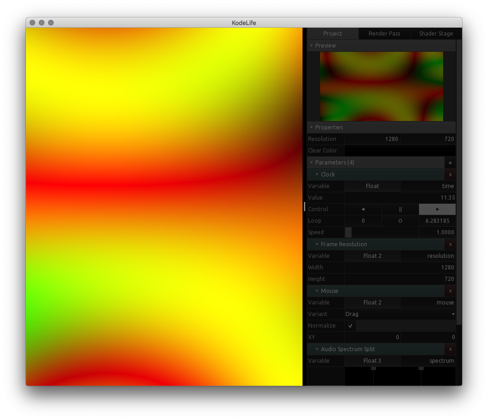
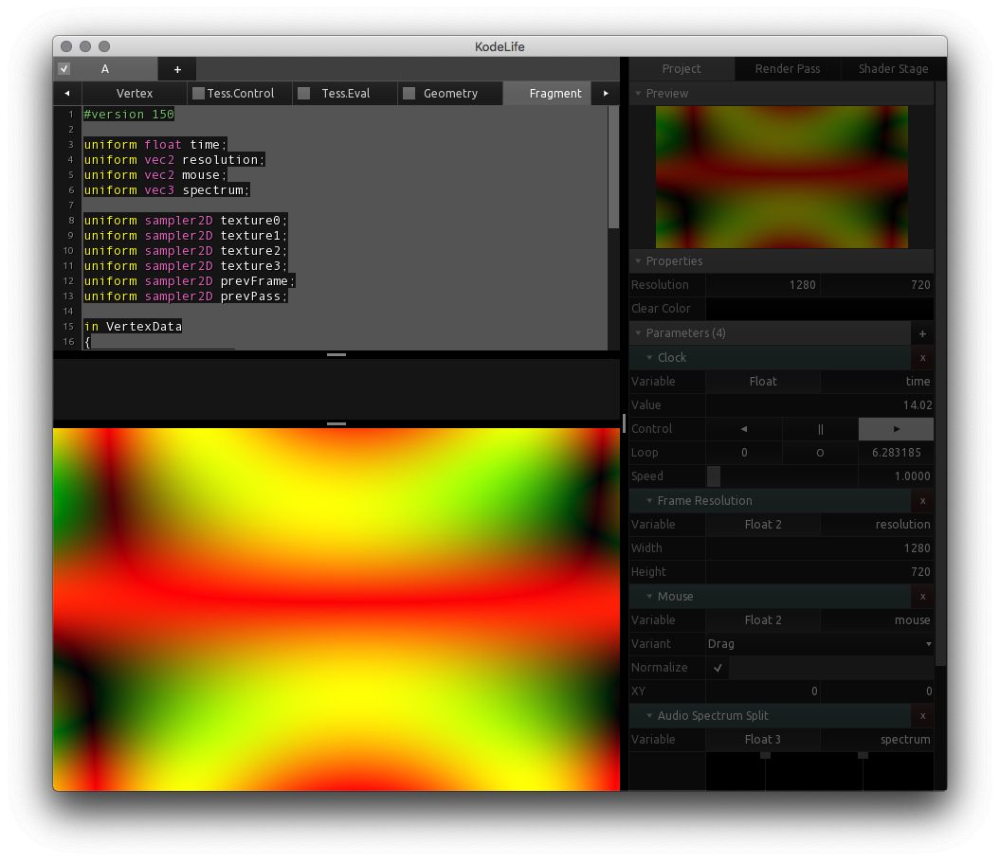

[Products](https://hexler.net/products) [Support](https://hexler.net/support) [Contact](https://hexler.net/contact)

Open main menu

[Products](https://hexler.net/products) [News](https://hexler.net/news) [Support](https://hexler.net/support) [Contact](https://hexler.net/contact)

[ **KodeLife**  
\
**Real-time GPU shader editor**](https://hexler.net/kodelife)

###### [Introduction](internal-display.md)

###### [Getting started](getting-started.md)

###### [Interface](interface.md)

- [Editor](interface-editor.md)
- [Output](interface-output.md)
- [Menu Bar](interface-menubar.md)

###### [Kontrol Panel](kontrolpanel.md)

- [Project](kontrolpanel-project.md)
- [Pass](kontrolpanel-pass.md)
- [Shader Stage](kontrolpanel-shaderstage.md)

###### [Parameters](parameters.md)

- [Built-In](parameters-built-in.md)
- [Constant](parameters-constant.md)

###### [Preferences](preferences-general.md)

- [General](preferences-general.md)
- [Editor](preferences-editor.md)
- [Output](preferences-output.md)
- [Shader](preferences-shader.md)
- [Audio](preferences-audio.md)

KodeLife Manual

#### Interface · Output

* * *

The project's **final output image** can be displayed in a variety of ways, including an independent, [external display window](preferences-output.md#external-display).

* * *

##### Window Layout

The default layout mode is to overlay the code editor on top of the output image. In Kodelife's [Preferences](preferences-general.md#window-layout), this type of window layout is referred to as **Stack**.

In this window layout mode the code editor can also be **hidden completeley**, as shown in the image above, either using the menu bar's [View &gt; Toggle Editor](interface-menubar.md#view) item, or by using the **key combination** displayed there.

The other two window layout modes (**Split Vertical/Horizontal**) arrange the code editor and the output image next to each other, either in **vertical** or **horizontal** direction respectively.

* * *

##### Scaling

As the available size of the display area will not always match up with the pixel resolution of the output image, KodeLife has some [Preferences](preferences-output.md#internal-display) for determining the **type of scale operation** that should be applied to the [internal](preferences-output.md#internal-display) and [external](preferences-output.md#external-display) displays.

* * *

##### Mouse Interaction

When the selected window layout mode is **Stack** and the code editor is hidden, or when using the **Split Vertical/Horizontal** layout modes, the output display area can be interacted with using mouse input in different ways:

- **Dragging the mouse cursor**
  
  changes the value of any [Mouse Simple Parameters](parameters-built-in.md#input-mouse-simple) present in the project.
- **Dragging the mouse cursor while holding down the shift key**
  
  will modify the the **Rotate** value of the **Model Matrix** of the currently active render pass' [Transform](kontrolpanel-pass.md#transform) settings.
- **Scrolling the mouse wheel**
  
  will modify the **Scale** value of the **Model Matrix** of the currently active render pass' [Transform](kontrolpanel-pass.md#transform) settings.

* * *

## hexler

- [Products](https://hexler.net/products)
- [News](https://hexler.net/news)
- [About](https://hexler.net/about)

## Support

- [Manuals](https://hexler.net/support/manuals)
- [Search](https://hexler.net/search)
- [Contact](https://hexler.net/contact)

## Legal

- [Terms of Service](https://hexler.net/terms-of-service)
- [Privacy Policy](https://hexler.net/privacy-policy)
- [Cookie Policy](https://hexler.net/cookie-policy)
- [特定商取引法](https://hexler.net/commercial-law)

Copyright © 2025 Hexler Limited. All rights reserved. v1.9.2.482

Cookie Policy

We use cookies to deliver website content. By continuing without changing your [preferences](https://hexler.net/cookie-policy), you agree to our use of cookies.

Accept