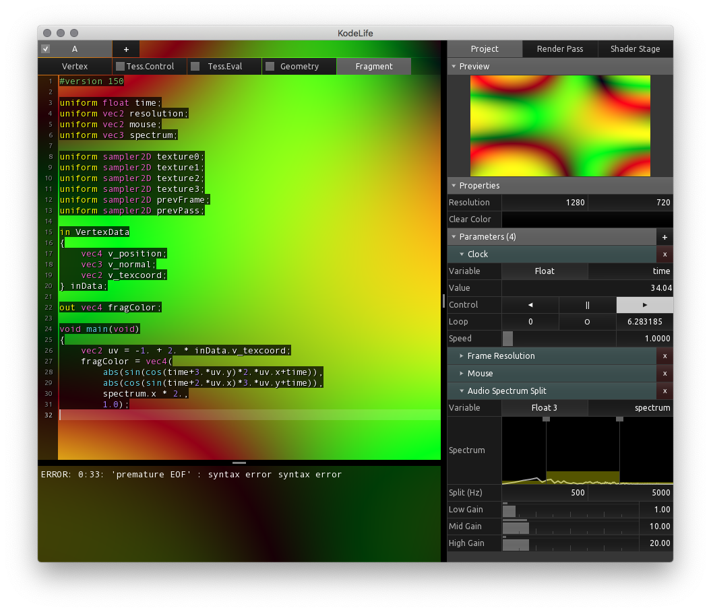

[Products](https://hexler.net/products) [Support](https://hexler.net/support) [Contact](https://hexler.net/contact)

Open main menu

[Products](https://hexler.net/products) [News](https://hexler.net/news) [Support](https://hexler.net/support) [Contact](https://hexler.net/contact)

[ **KodeLife**  
\
**Real-time GPU shader editor**](https://hexler.net/kodelife)

###### [Introduction](internal-display.md)

###### [Getting started](getting-started.md)

###### [Interface](interface.md)

- [Editor](interface-editor.md)
- [Output](interface-output.md)
- [Menu Bar](interface-menubar.md)

###### [Kontrol Panel](kontrolpanel.md)

- [Project](kontrolpanel-project.md)
- [Pass](kontrolpanel-pass.md)
- [Shader Stage](kontrolpanel-shaderstage.md)

###### [Parameters](parameters.md)

- [Built-In](parameters-built-in.md)
- [Constant](parameters-constant.md)

###### [Preferences](preferences-general.md)

- [General](preferences-general.md)
- [Editor](preferences-editor.md)
- [Output](preferences-output.md)
- [Shader](preferences-shader.md)
- [Audio](preferences-audio.md)

KodeLife Manual

#### Interface

* * *

The main interface is a split view that divides the [editor](interface-editor.md), with integrated display of the final [output](interface-output.md) image, to the left from the [Kontrol Panel](kontrolpanel.md), with hosts most of KodeLife's controls, to the right.

One of KodeLife's most obvious (and, if we might say so ourselves, maybe coolest) features is the ability to overlay the code you create in the editor directly on top of a real-time rendition of the project's final output image.

You can of course choose to display the output in a variety of [alternative layouts](preferences-general.md#window-layout) or in an [external window](preferences-output.md#external-display) as well.

* * *

## hexler

- [Products](https://hexler.net/products)
- [News](https://hexler.net/news)
- [About](https://hexler.net/about)

## Support

- [Manuals](https://hexler.net/support/manuals)
- [Search](https://hexler.net/search)
- [Contact](https://hexler.net/contact)

## Legal

- [Terms of Service](https://hexler.net/terms-of-service)
- [Privacy Policy](https://hexler.net/privacy-policy)
- [Cookie Policy](https://hexler.net/cookie-policy)
- [特定商取引法](https://hexler.net/commercial-law)

Copyright © 2025 Hexler Limited. All rights reserved. v1.9.2.482

Cookie Policy

We use cookies to deliver website content. By continuing without changing your [preferences](https://hexler.net/cookie-policy), you agree to our use of cookies.

Accept