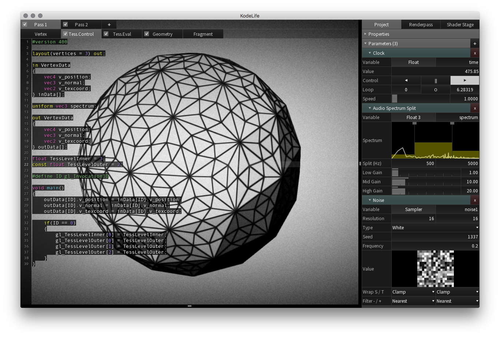

[Products](https://hexler.net/products) [Support](https://hexler.net/support) [Contact](https://hexler.net/contact)

Open main menu

[Products](https://hexler.net/products) [News](https://hexler.net/news) [Support](https://hexler.net/support) [Contact](https://hexler.net/contact)

[ **KodeLife**  
\
**Real-time GPU shader editor**](https://hexler.net/kodelife)

###### [Introduction](internal-display.md)

###### [Getting started](getting-started.md)

###### [Interface](interface.md)

- [Editor](interface-editor.md)
- [Output](interface-output.md)
- [Menu Bar](interface-menubar.md)

###### [Kontrol Panel](kontrolpanel.md)

- [Project](kontrolpanel-project.md)
- [Pass](kontrolpanel-pass.md)
- [Shader Stage](kontrolpanel-shaderstage.md)

###### [Parameters](parameters.md)

- [Built-In](parameters-built-in.md)
- [Constant](parameters-constant.md)

###### [Preferences](preferences-general.md)

- [General](preferences-general.md)
- [Editor](preferences-editor.md)
- [Output](preferences-output.md)
- [Shader](preferences-shader.md)
- [Audio](preferences-audio.md)

KodeLife Manual

#### Introduction

* * *

##### KodeLife is a real-time GPU shader editor.

As modern GPUs and graphics APIs have transitioned from the so-called "fixed function pipeline" to the "programmable pipeline" it has become more and more complex to get started with graphics programming.

On top of the operating system dependent code that needs to be written to provide a main routine, create windows and then render contexts, graphics API specific CPU-side code to load resources, data and geometry, probe extensions and then specify and dispatch clear, draw and compute calls, now one has to also author, load, compile, upload and debug shader programs to be executed on the GPU itself to control the actions taken by a modern graphics processor in composing images and processing data...

All this requires an enormous amount of knowledge to get even a minimal, modern graphics program up and running, and provides a significant barrier for **newcomers** to get started in the field.

But also to the seasoned graphics **professional**, wanting to quickly sketch out an idea for a new lighting calculation or procedural shading method, the industry-standard, multi-gigabyte engine framework, built around all the requirements of a AAA game studio, might be more of a hurdle to spontaneous creativity and inspiration than a helpful blessing.

* * *

##### This is why we created KodeLife as a shortcut straight to the core of a modern GPU's heart: shader development.

It can provide **short iteration times** from idea to prototype, with quick evaluation, background re-compilation and display.

It can be a **learning and teaching tool** for absolute beginners to practice **"playful, interactive exploration"** in real-time, without having to study years and years of API and programming language cruft first, just to get to that first, shaded triangle on screen (or more likely, quit at the infamous, inexplicable "black screen").

When we started working on KodeLife in **2010** (then called "codelife"), there were a handful of tools aimed at graphics professionals, providing deep and complex feature sets, but nothing that fulfilled our desire for that quick rush of **"launch, type, view"**.

Most of these tools have now sadly ceased to be, and while KodeLife can not yet provide the same deep feature set, we have plans to re-create some of that depth, and will continue to listen to all feature requests and needs, and will expand on KodeLife's features in the many years to come.

Furthermore, as **live-coding** has become much more "en vogue" in recent years, many new tools have been developed to scratch that itch for quick and dirty live shader coding.

We welcome this development, but will continue our efforts, as we feel there is a need for a **deeper feature set** for the professional than most of these younger tools provide, and to deliver a **different platform** for beginners to get started on and grow, in addition to mostly web-based, multi-level abstractions and tools targeting the simplest, easiest and smallest common denominator.

* * *

##### We believe there is a need for a fast and powerful, cross-platform, cross-API and native tool, that can give access to the full, raw power of the GPU with minimum effort and overhead.

* * *

## hexler

- [Products](https://hexler.net/products)
- [News](https://hexler.net/news)
- [About](https://hexler.net/about)

## Support

- [Manuals](https://hexler.net/support/manuals)
- [Search](https://hexler.net/search)
- [Contact](https://hexler.net/contact)

## Legal

- [Terms of Service](https://hexler.net/terms-of-service)
- [Privacy Policy](https://hexler.net/privacy-policy)
- [Cookie Policy](https://hexler.net/cookie-policy)
- [特定商取引法](https://hexler.net/commercial-law)

Copyright © 2025 Hexler Limited. All rights reserved. v1.9.2.482

Cookie Policy

We use cookies to deliver website content. By continuing without changing your [preferences](https://hexler.net/cookie-policy), you agree to our use of cookies.

Accept