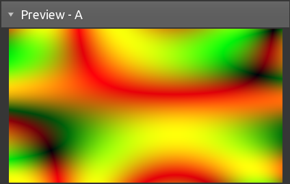
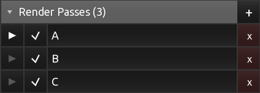
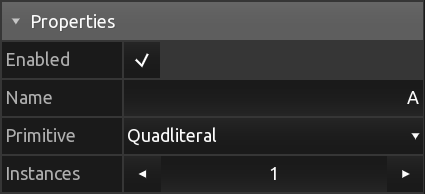
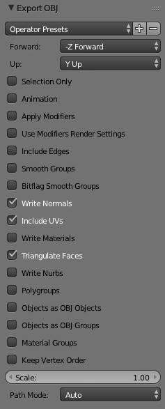
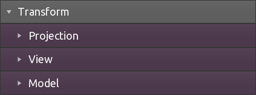
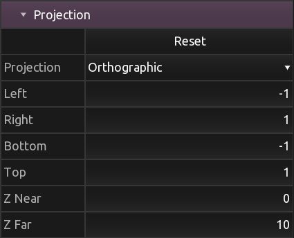
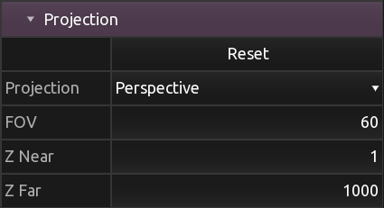
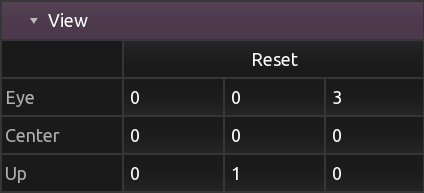
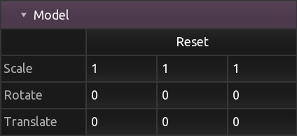
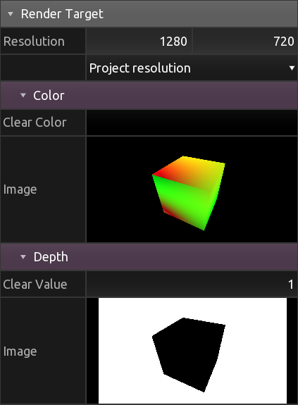

[Products](https://hexler.net/products) [Support](https://hexler.net/support) [Contact](https://hexler.net/contact)

Open main menu

[Products](https://hexler.net/products) [News](https://hexler.net/news) [Support](https://hexler.net/support) [Contact](https://hexler.net/contact)

[ **KodeLife**  
\
**Real-time GPU shader editor**](https://hexler.net/kodelife)

###### [Introduction](internal-display.md)

###### [Getting started](getting-started.md)

###### [Interface](interface.md)

- [Editor](interface-editor.md)
- [Output](interface-output.md)
- [Menu Bar](interface-menubar.md)

###### [Kontrol Panel](kontrolpanel.md)

- [Project](kontrolpanel-project.md)
- [Pass](kontrolpanel-pass.md)
- [Shader Stage](kontrolpanel-shaderstage.md)

###### [Parameters](parameters.md)

- [Built-In](parameters-built-in.md)
- [Constant](parameters-constant.md)

###### [Preferences](preferences-general.md)

- [General](preferences-general.md)
- [Editor](preferences-editor.md)
- [Output](preferences-output.md)
- [Shader](preferences-shader.md)
- [Audio](preferences-audio.md)

KodeLife Manual

#### Kontrol Panel · Pass

* * *

The Kontrol Panel's Pass section holds properties and settings associated with a pass and its inputs and outputs.

A pass represents one draw call or compute workload executed by the graphics API. Read more about KodeLife's **project structure** in the introduction to the [Kontrol Panel](kontrolpanel.md#project-structure).

* * *

##### Preview

Displays a preview of the currently selected pass' output image (if any).

* * *

##### Passes

List of all the current project's passes with indicators for type (**R** for render pass, **C** for compute pass), selected, and enabled state.

From this list, new passes can be **added** by clicking **+** and confirming the type of pass at the prompt. Existing passes can be **removed** by clicking **x** and confirming the prompt.

**Note** Removing a pass can currently not be undone.

* * *

##### Properties

###### Pass Type

The type of pass.

Can be either of **RENDER** or **COMPUTE**.

###### Enabled

The pass' enabled state.

Disabled passes will not be processed when updating the project each frame. The pass' preview and all other references to this pass' output will use the image that was generated when the pass was last enabled and updated.

###### Name

A name to identify the pass by in KodeLife's user interface.

###### Primitive

Type of geometry that will be rendered by the render pass.

By selecting **File** an external 3D object file can be loaded from the filesystem. The following formats are supported:

- COLLADA
- FBX
- GLTF
- NFF
- OBJ
- PLY
- X

These are the recommended settings when exporting Wavefront OBJ from [Blender](https://blender.org). Please consult your 3D modelling package's documentation for equivalent options.

- Write Normals
- Include UV's
- Triangulate Faces

###### Instances

Number of instances of the selected primitive to be rendered by the render pass.

* * *

##### Transform

Provides commonly used matrices for editing. These are completely optional and could be specified or computed in the shader source code directly.

- **Projection**
  
  
  
  
  
  A projection matrix that can be submitted to shader stages using the [Projection Matrix Parameter](parameters-built-in.md#transform-projection).
- **View**
  
  
  
  A view matrix that can be submitted to shader stages using the [View Matrix Parameter](parameters-built-in.md#transform-view).
- **Model**
  
  
  
  A model matrix that can be submitted to shader stages using the [Model Matrix Parameter](parameters-built-in.md#transform-model). When using the output view's [mouse interaction](interface-output.md#mouse-interaction) controls, the model matrix will be changed by KodeLife.

Based on these three matrices, KodeLife also computes a **Model View Projection Matrix** and **Normal Matrix** (the transpose inverse of the model matrix) which can be submitted to shader stages using the [Model View Projection Matrix Parameter](parameters-built-in.md#transform-mvp) and [Normal Matrix Parameter](parameters-built-in.md#transform-normal) respectively.

* * *

##### Render Target

Specifies properties of the render target of the render pass' render operation.

- **Resolution**
  
  Pixel resolution of both the color and depth attachments of the render pass' render target. Defaults to project resolution, with additional presets for half the project resolution and completely custom dimensions.
- **Color**
  
  Preview and clear color selection of the render target's color attachment.
- **Depth**
  
  Preview and clear value selection of the render target's depth attachment.

* * *

##### Parameters

Parameters added at the pass level, that will be set and updated for all shader stages in this pass.

Clicking the **+** button at the end of the header row will open a menu with all available [Parameter Types](parameters.md).

* * *

## hexler

- [Products](https://hexler.net/products)
- [News](https://hexler.net/news)
- [About](https://hexler.net/about)

## Support

- [Manuals](https://hexler.net/support/manuals)
- [Search](https://hexler.net/search)
- [Contact](https://hexler.net/contact)

## Legal

- [Terms of Service](https://hexler.net/terms-of-service)
- [Privacy Policy](https://hexler.net/privacy-policy)
- [Cookie Policy](https://hexler.net/cookie-policy)
- [特定商取引法](https://hexler.net/commercial-law)

Copyright © 2025 Hexler Limited. All rights reserved. v1.9.2.482

Cookie Policy

We use cookies to deliver website content. By continuing without changing your [preferences](https://hexler.net/cookie-policy), you agree to our use of cookies.

Accept