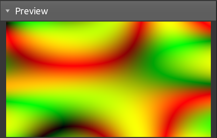
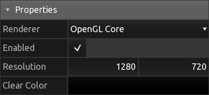
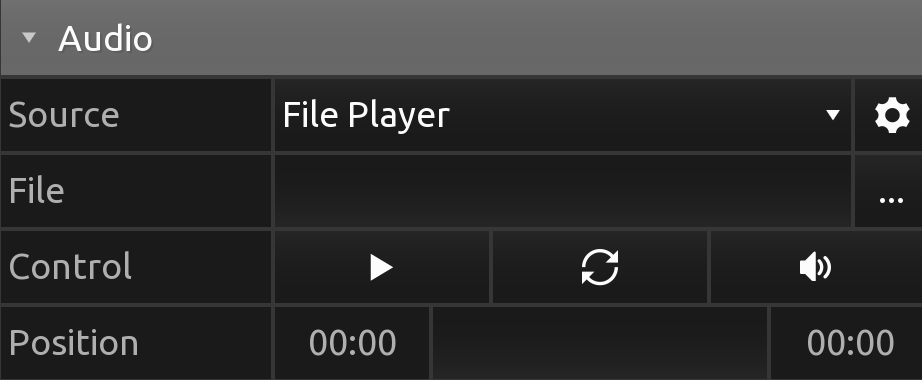

[Products](https://hexler.net/products) [Support](https://hexler.net/support) [Contact](https://hexler.net/contact)

Open main menu

[Products](https://hexler.net/products) [News](https://hexler.net/news) [Support](https://hexler.net/support) [Contact](https://hexler.net/contact)

[ **KodeLife**  
\
**Real-time GPU shader editor**](https://hexler.net/kodelife)

###### [Introduction](internal-display.md)

###### [Getting started](getting-started.md)

###### [Interface](interface.md)

- [Editor](interface-editor.md)
- [Output](interface-output.md)
- [Menu Bar](interface-menubar.md)

###### [Kontrol Panel](kontrolpanel.md)

- [Project](kontrolpanel-project.md)
- [Pass](kontrolpanel-pass.md)
- [Shader Stage](kontrolpanel-shaderstage.md)

###### [Parameters](parameters.md)

- [Built-In](parameters-built-in.md)
- [Constant](parameters-constant.md)

###### [Preferences](preferences-general.md)

- [General](preferences-general.md)
- [Editor](preferences-editor.md)
- [Output](preferences-output.md)
- [Shader](preferences-shader.md)
- [Audio](preferences-audio.md)

KodeLife Manual

#### Kontrol Panel · Project

* * *

The Kontrol Panel's Project section holds all properties and settings associated with the whole project and the project's final master output image.

* * *

##### Preview

Displays a preview of the current project's final output image

* * *

##### Properties

###### Renderer

The currently active renderer backend and shader language source type. This is the same setting as the [Graphics API](preferences-general.md#graphics-api) preference option.

###### Enabled

If enabled, the final output image will be updated each frame. Otherwise, the last generated output image will be displayed.

###### Resolution

Pixel resolution of the 2D color texture to which the final output image of the project will be rendered to.

Render passes by default are configured to use this project resolution for their individual output images, but can be configured to use any custom resolution as well.

###### Clear Color

RGBA color that the 2D color texture will be cleared to before rendering the project's final output image.

* * *

##### Audio

###### Source

The source audio input used by all audio-based parameters:

- **Default Input** will use the input configured in the [Audio Preferences](preferences-audio.md). You can access KodeLife's audio preferences by clicking on the gear icon to the right of the source selection.
- **File Player** will play back a local audio file

###### File

The file to be played back. KodeLife can play the following audio formats:

- WAV
- MP3
- AIFF
- FLAC
- OGG

###### Control

File playback control:

- Play/Stop
- Loop on/off
- Gain control 0% - 200%

###### Position

Current file playback position and search bar

* * *

##### Parameters

Parameters added at the project level, that will be set and updated for all passes and all shader stages.

Clicking the **+** button at the end of the header row will open a menu with all available [Parameter Types](parameters.md)

* * *

## hexler

- [Products](https://hexler.net/products)
- [News](https://hexler.net/news)
- [About](https://hexler.net/about)

## Support

- [Manuals](https://hexler.net/support/manuals)
- [Search](https://hexler.net/search)
- [Contact](https://hexler.net/contact)

## Legal

- [Terms of Service](https://hexler.net/terms-of-service)
- [Privacy Policy](https://hexler.net/privacy-policy)
- [Cookie Policy](https://hexler.net/cookie-policy)
- [特定商取引法](https://hexler.net/commercial-law)

Copyright © 2025 Hexler Limited. All rights reserved. v1.9.2.482

Cookie Policy

We use cookies to deliver website content. By continuing without changing your [preferences](https://hexler.net/cookie-policy), you agree to our use of cookies.

Accept