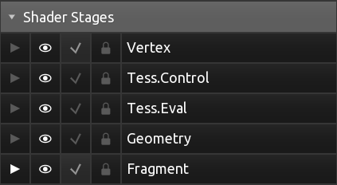
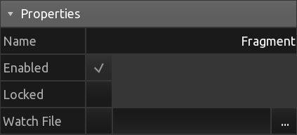

[Products](https://hexler.net/products) [Support](https://hexler.net/support) [Contact](https://hexler.net/contact)

Open main menu

[Products](https://hexler.net/products) [News](https://hexler.net/news) [Support](https://hexler.net/support) [Contact](https://hexler.net/contact)

[ **KodeLife**  
\
**Real-time GPU shader editor**](https://hexler.net/kodelife)

###### [Introduction](internal-display.md)

###### [Getting started](getting-started.md)

###### [Interface](interface.md)

- [Editor](interface-editor.md)
- [Output](interface-output.md)
- [Menu Bar](interface-menubar.md)

###### [Kontrol Panel](kontrolpanel.md)

- [Project](kontrolpanel-project.md)
- [Pass](kontrolpanel-pass.md)
- [Shader Stage](kontrolpanel-shaderstage.md)

###### [Parameters](parameters.md)

- [Built-In](parameters-built-in.md)
- [Constant](parameters-constant.md)

###### [Preferences](preferences-general.md)

- [General](preferences-general.md)
- [Editor](preferences-editor.md)
- [Output](preferences-output.md)
- [Shader](preferences-shader.md)
- [Audio](preferences-audio.md)

KodeLife Manual

#### Kontrol Panel · Shader Stage

* * *

The Kontrol Panel's Shader Stage section holds properties and settings associated with a single shader stage.

Read more about KodeLife's **project structure** in the introduction to the [Kontrol Panel](kontrolpanel.md#project-structure).

* * *

##### Shader Stages

This list gives an overview of all the shader stages and their statuses in the current pass.

- **Selected** - shader stage currently selected in the editor
- **Hidden** - hide the shader stage's tab in the editor
- **Enabled** - enabled status of the shader stage (see [Enabled](kontrolpanel-shaderstage.md#enabled) property)
- **Locked** - locked status of the shader stage (see [Locked](kontrolpanel-shaderstage.md#locked) property)

* * *

##### Properties

###### Name

Common name of the shader stage.

KodeLife follows OpenGL nomenclature so shader stages are named Vertex, Tessellation Control, Tessellation Evaluation, Geometry and Fragment shader and listed in the order of execution in the pipeline.

###### Enabled

Enabled state of the shader stage. Some shader stages are optional and can be enabled and disabled.

###### Locked

Locked status of the shader stages' source code.

When a shader stage is locked, no modifications to its source code can be made in KodeLife's [editor](interface-editor.md).

###### Watch File

External file watch status and path.

A shader stage's source code can be pulled and automatically updated from an external file. When enabling this feature the shader stage will also be automatically locked for local modification in KodeLife's [editor](interface-editor.md).

* * *

##### Parameters

Parameters added at the shader stage level, that will be set and updated only for this single shader stage.

Clicking the **+** button at the end of the header row will open a menu with all available [Parameter Types](parameters.md).

* * *

## hexler

- [Products](https://hexler.net/products)
- [News](https://hexler.net/news)
- [About](https://hexler.net/about)

## Support

- [Manuals](https://hexler.net/support/manuals)
- [Search](https://hexler.net/search)
- [Contact](https://hexler.net/contact)

## Legal

- [Terms of Service](https://hexler.net/terms-of-service)
- [Privacy Policy](https://hexler.net/privacy-policy)
- [Cookie Policy](https://hexler.net/cookie-policy)
- [特定商取引法](https://hexler.net/commercial-law)

Copyright © 2025 Hexler Limited. All rights reserved. v1.9.2.482

Cookie Policy

We use cookies to deliver website content. By continuing without changing your [preferences](https://hexler.net/cookie-policy), you agree to our use of cookies.

Accept