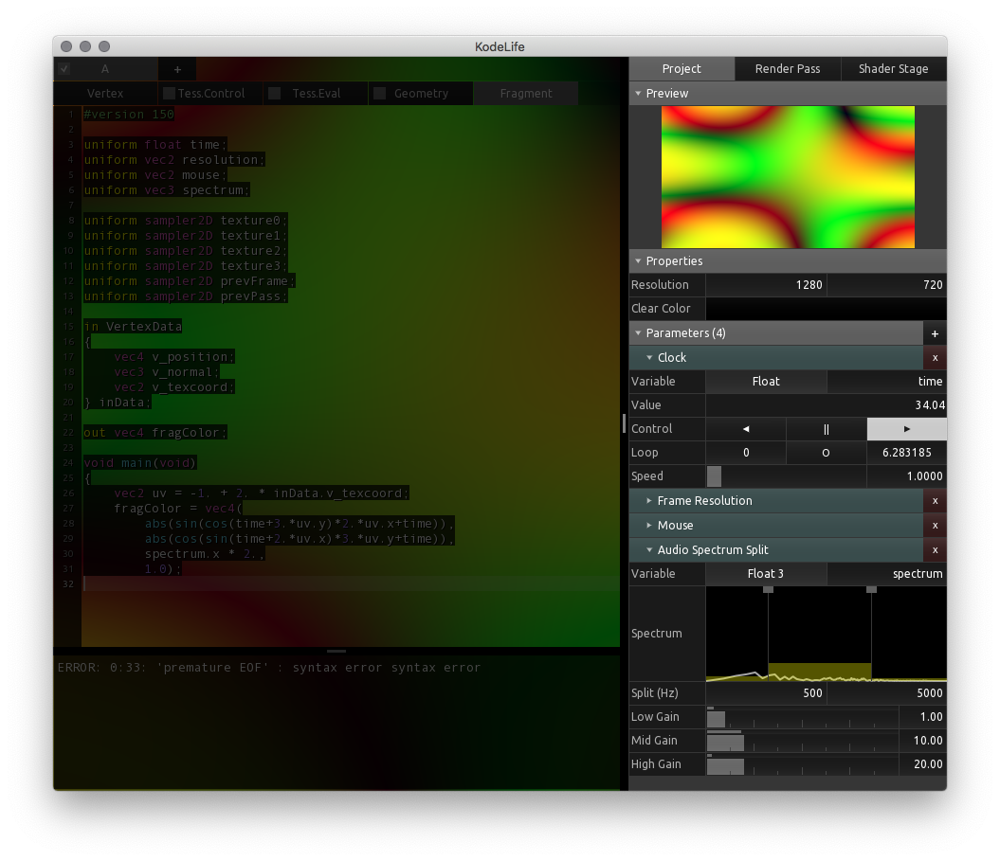

[Products](https://hexler.net/products) [Support](https://hexler.net/support) [Contact](https://hexler.net/contact)

Open main menu

[Products](https://hexler.net/products) [News](https://hexler.net/news) [Support](https://hexler.net/support) [Contact](https://hexler.net/contact)

[ **KodeLife**  
\
**Real-time GPU shader editor**](https://hexler.net/kodelife)

###### [Introduction](internal-display.md)

###### [Getting started](getting-started.md)

###### [Interface](interface.md)

- [Editor](interface-editor.md)
- [Output](interface-output.md)
- [Menu Bar](interface-menubar.md)

###### [Kontrol Panel](kontrolpanel.md)

- [Project](kontrolpanel-project.md)
- [Pass](kontrolpanel-pass.md)
- [Shader Stage](kontrolpanel-shaderstage.md)

###### [Parameters](parameters.md)

- [Built-In](parameters-built-in.md)
- [Constant](parameters-constant.md)

###### [Preferences](preferences-general.md)

- [General](preferences-general.md)
- [Editor](preferences-editor.md)
- [Output](preferences-output.md)
- [Shader](preferences-shader.md)
- [Audio](preferences-audio.md)

KodeLife Manual

#### Kontrol Panel

* * *

To the right of the application window is the **Kontrol Panel**, which is the nerve center of the application and is home to most of the **options, settings and switches** that control KodeLife's operation.

The Kontrol Panel can be **completely hidden** from the menu bar's [View Menu](interface-menubar.md).

* * *

##### Project Structure

The Kontrol Panel structures a KodeLife project into three levels: [Project](kontrolpanel-project.md), [Pass](kontrolpanel-pass.md) and [Shader Stage](kontrolpanel-shaderstage.md).

A project can contain **many passes**, and each pass can consist of **up to five shader stages** depending on the type of pass, the selected graphics API and supported types of shader stages.

At each of these levels contextual properties can be set and edited, and at all levels **Parameters** can be added.

* * *

##### Parameters

**Parameter** is KodeLife's universal term for **per-draw-call or per-compute-call constant data** passed to a shader stage, analogous to what some graphics APIs call **uniform** or **shader constant**.

Depending on at which level in the project's structure a parameter is added, it will be submitted to **all, some or a single shader stage**:

- **Project Parameter**
  
  All shader stages in all passes of the project
- **Pass Parameter**
  
  All shader stages in the pass
- **Shader Stage Parameter**
  
  Only the single shader stage

To see a list and descriptions of the available parameters, please see the [Parameters](parameters.md) section.

* * *

###### Note

If the graphics API requires parameters to be submitted using **buffer objects** (ie Apple's Metal), the buffer object will be constructed in a **deterministic manner**, ordering parameters by **Project &gt; Pass &gt; Shader Stage**, and at each of these levels in the same order as they are listed in the UI.

###### Note

It is advised to add a parameter at the **lowest, most specific level** it is going to be used at, as setting and updating a parameter for all shader stages in all passes of a project can cause **significant overhead**.

###### Note

KodeLife **never modifies** your shaders' source code in any way, so when adding parameters at any level, **the declaration the shading language requires for the parameter** to be referenced and used in the shader program itself has to be added to the shader's source code manually.

* * *

## hexler

- [Products](https://hexler.net/products)
- [News](https://hexler.net/news)
- [About](https://hexler.net/about)

## Support

- [Manuals](https://hexler.net/support/manuals)
- [Search](https://hexler.net/search)
- [Contact](https://hexler.net/contact)

## Legal

- [Terms of Service](https://hexler.net/terms-of-service)
- [Privacy Policy](https://hexler.net/privacy-policy)
- [Cookie Policy](https://hexler.net/cookie-policy)
- [特定商取引法](https://hexler.net/commercial-law)

Copyright © 2025 Hexler Limited. All rights reserved. v1.9.2.482

Cookie Policy

We use cookies to deliver website content. By continuing without changing your [preferences](https://hexler.net/cookie-policy), you agree to our use of cookies.

Accept