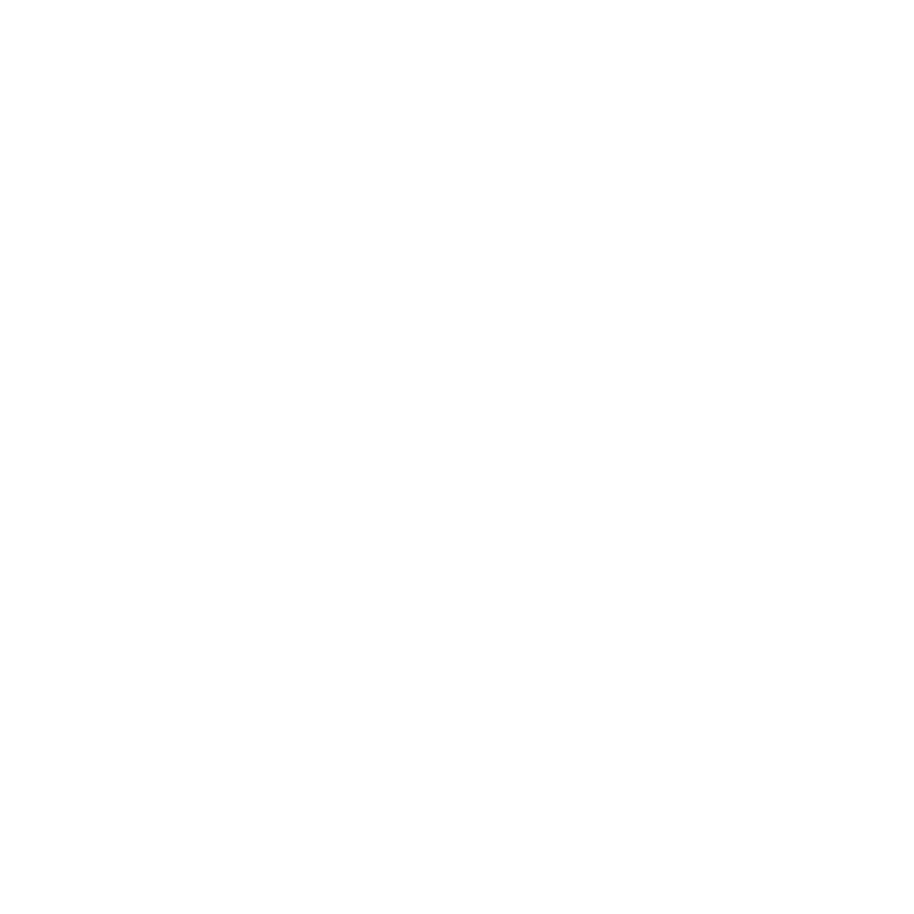
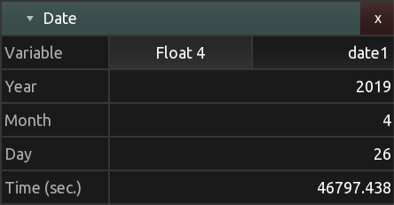

[](https://hexler.net/)

[Products](https://hexler.net/products) [Support](https://hexler.net/support) [Contact](https://hexler.net/contact)

Open main menu

[Products](https://hexler.net/products) [News](https://hexler.net/news) [Support](https://hexler.net/support) [Contact](https://hexler.net/contact)

[ **KodeLife**  
\
**Real-time GPU shader editor**](https://hexler.net/kodelife)

###### [Introduction](internal-display.md)

###### [Getting started](getting-started.md)

###### [Interface](interface.md)

- [Editor](interface-editor.md)
- [Output](interface-output.md)
- [Menu Bar](interface-menubar.md)

###### [Kontrol Panel](kontrolpanel.md)

- [Project](kontrolpanel-project.md)
- [Pass](kontrolpanel-pass.md)
- [Shader Stage](kontrolpanel-shaderstage.md)

###### [Parameters](parameters.md)

- [Built-In](parameters-built-in.md)
- [Constant](parameters-constant.md)

###### [Preferences](preferences-general.md)

- [General](preferences-general.md)
- [Editor](preferences-editor.md)
- [Output](preferences-output.md)
- [Shader](preferences-shader.md)
- [Audio](preferences-audio.md)

KodeLife Manual

#### Parameters · Built-In

* * *

These are parameters that KodeLife treats specially and that usually either use values from KodeLife's internals or require special handling by the application each frame update.

* * *

- [Clock](parameters-built-in.md#clock)
- [Date](parameters-built-in.md#date)
- [Time](parameters-built-in.md#time)
- [Noise](parameters-built-in.md#noise)

<!--THE END-->

- [Frame](parameters-built-in.md#frame)
  
  - [Number](parameters-built-in.md#frame-number)
  - [Delta](parameters-built-in.md#frame-delta)
  - [Resolution](parameters-built-in.md#frame-resolution)
  - [Previous Frame](parameters-built-in.md#frame-previous-frame)
  - [Editor](parameters-built-in.md#frame-editor)
- [Transform](parameters-built-in.md#transform)
  
  - [Model](parameters-built-in.md#transform-model)
  - [Normal](parameters-built-in.md#transform-normal)
  - [View](parameters-built-in.md#transform-view)
  - [Projection](parameters-built-in.md#transform-projection)
  - [MVP](parameters-built-in.md#transform-mvp)
- [Audio](parameters-built-in.md#audio)
  
  - [Sample Rate](parameters-built-in.md#audio-samplerate)
  - [Spectrum Split](parameters-built-in.md#audio-spectrum-split)
  - [Spectrum Full](parameters-built-in.md#audio-spectrum-full)
- [Input](parameters-built-in.md#input)
  
  - [Mouse Simple](parameters-built-in.md#input-mouse-simple)
  - [MIDI Channel](parameters-built-in.md#input-midi-channel)
  - [Gamepad](parameters-built-in.md#input-gamepad)

* * *

##### Clock


The clock parameter provides a flexible timing mechanism with lots of configurability for driving animations.

- Control: Direction of clock counter, reverse, pause, forward
- Loop: start value, enable, end value
- Speed: multiplier relative to "real-time"

* * *

##### Date



The current date as year, month, day, current time in seconds

* * *

##### Time


The current time as hour, minute, seconds, milliseconds

* * *

##### Noise


A noise texture generator

* * *

##### Frame

###### Number


Sequence number of the current frame being rendered

###### Delta


Delta time between current and previous frame, in milliseconds

###### Resolution


Project's master output frame resolution in pixels

###### Previous Frame


A two dimensional texture sampler for the most recently rendered master output frame.

###### Previous Render Pass


A two dimensional texture sampler for the most recently rendered frame (either color or depth attachment) of a render pass.

The selection `Render Pass` allows to select any of the other render passes present in the project directly, or the `Previous` one, meaning the render pass directly preceding the current one in the project. If the selected render pass is the current one, the most recently rendered frame will be used.

###### Editor


A two dimensional texture sampler for the most recently rendered frame of KodeLife's text editor

* * *

##### Transform

###### Model

A render pass' model matrix as specified in the Kontrol Panel's render pass [Transform](kontrolpanel-pass.md#transform) section.

###### Normal

A normal matrix calculated from a render pass' model matrix as specified in the Kontrol Panel's render pass [Transform](kontrolpanel-pass.md#transform) section.

###### View

A render pass' view matrix as specified in the Kontrol Panel's render pass [Transform](kontrolpanel-pass.md#transform) section.

###### Projection

A render pass' projection matrix as specified in the Kontrol Panel's render pass [Transform](kontrolpanel-pass.md#transform) section.

###### MVP

A model-view-projection matrix calculated from a render pass' model, view and projection matrices as specified in the Kontrol Panel's render pass [Transform](kontrolpanel-pass.md#transform) section.

* * *

##### Audio

###### Sample Rate


The currently [configured](preferences-audio.md) sample-rate of KodeLife's audio subsystem

###### Spectrum Split


A vector of three floating point values representing the power of three configurable bands of the currently playing/incoming audio signal

###### Spectrum Full


A two-dimensional texture image containing all values of a spectrum analysis performed on the currently playing/incoming audio signal

* * *

##### Input

###### Mouse Simple


A simple mouse state representation

###### MIDI Channel


A two dimensional texture image containing all standard MIDI message values most recently received on a selected or all channels combined.

All possible MIDI messages for one channel are layed out in the texture in the same order as listed here: [https://www.midi.org/specifications-old/item/table-1-summary-of-midi-message](https://www.midi.org/specifications-old/item/table-1-summary-of-midi-message)

Thinking of the texture as a linear array, the messages are written to the array as follows:

NOTE OFF texture\[0 * 127 + note] = velocity NOTE ON texture\[1 * 127 + note] = velocity POLYPRESSURE texture\[2 * 127 + note] = pressure CONTROLCHANGE texture\[3 * 127 + controller number] = controller value PROGRAMCHANGE texture\[4 * 127] = program number CHANNELPRESSURE texture\[4 * 127 + 1] = pressure value PITCHBEND texture\[4 * 127 + 2] = value

**Note:** If a *NOTE OFF* message of any velocity is received, the corresponding *NOTE ON* entry at index *note* will be set to zero and vice versa.

To retrieve it's easiest to use "texelFetch" and integer coordinates:

```
ivec2 midiCoord(int offset)
{
    int x = offset % 32;
    int y = offset / 32;
    return ivec2(x,y);
}
```

Thus reading the value of a controller:

```
int ccNumber = 0;
texelFetch(midiTexture, midiCoord(3 * 127 + ccNumber), 0);
```

Or using the regular texture sampling function:

```
texture(midiTexture, vec2((1./32.) * midiCoord(3 * 127 + ccNumber)));
```

* * *

##### Gamepad


A two dimensional texture image containing all current values for one of maximum four connected standard game controllers.

Recognized game pads are mapped to a standard Xbox 360-like controller layout: A directional pad, two analog sticks, four buttons on the right (often called A, B, X, Y), shoulder buttons (two of which might be axes) and three buttons in the middle (Start, Back and usually some kind of logo-button).

If your game controller is not recognized, it is possible to update the database of mappings by placing a file following [SDL2's game controller db format](https://github.com/gabomdq/SDL_GameControllerDB) in KodeLife's configuration and log file directory.

KodeLife will look for a file called "gamecontrollerdb.txt" on startup and load and apply that configuration if found.

See [Preferences | General](preferences-general.md#enable-debug-logging) for a **Show logs** shortcut to reveal the location of this directory.

Thinking of the texture as a linear array, the inputs are written to the array as follows:

Index Value 0 Gamepad connected 1 STICK\_LEFT\_X 2 STICK\_LEFT\_Y 3 STICK\_RIGHT\_X 4 STICK\_RIGHT\_Y 5 TRIGGER\_LEFT 6 TRIGGER\_RIGHT 7 BUTTON\_UP 8 BUTTON\_DOWN 9 BUTTON\_LEFT 10 BUTTON\_RIGHT 11 BUTTON\_A 12 BUTTON\_B 13 BUTTON\_X 14 BUTTON\_Y 15 BUTTON\_STICK\_LEFT 16 BUTTON\_STICK\_RIGHT 17 BUMPER\_LEFT 18 BUMPER\_RIGHT 19 BUTTON\_START 20 BUTTON\_SELECT 21 BUTTON\_HOME

* * *

## hexler

- [Products](https://hexler.net/products)
- [News](https://hexler.net/news)
- [About](https://hexler.net/about)

## Support

- [Manuals](https://hexler.net/support/manuals)
- [Search](https://hexler.net/search)
- [Contact](https://hexler.net/contact)

## Legal

- [Terms of Service](https://hexler.net/terms-of-service)
- [Privacy Policy](https://hexler.net/privacy-policy)
- [Cookie Policy](https://hexler.net/cookie-policy)
- [特定商取引法](https://hexler.net/commercial-law)

Copyright © 2025 Hexler Limited. All rights reserved. v1.9.2.482

[](https://www.facebook.com/hexler)[](https://www.instagram.com/hexler.heavy.industries)[](https://www.threads.net/@hexler.heavy.industries)[](https://twitter.com/hexler_net)[](https://vimeo.com/hexler)[](https://www.tiktok.com/@hexler.net)[](https://mastodon.social/@hexler)[](https://bsky.app/profile/hexler.bsky.social)

Cookie Policy

We use cookies to deliver website content. By continuing without changing your [preferences](https://hexler.net/cookie-policy), you agree to our use of cookies.

Accept